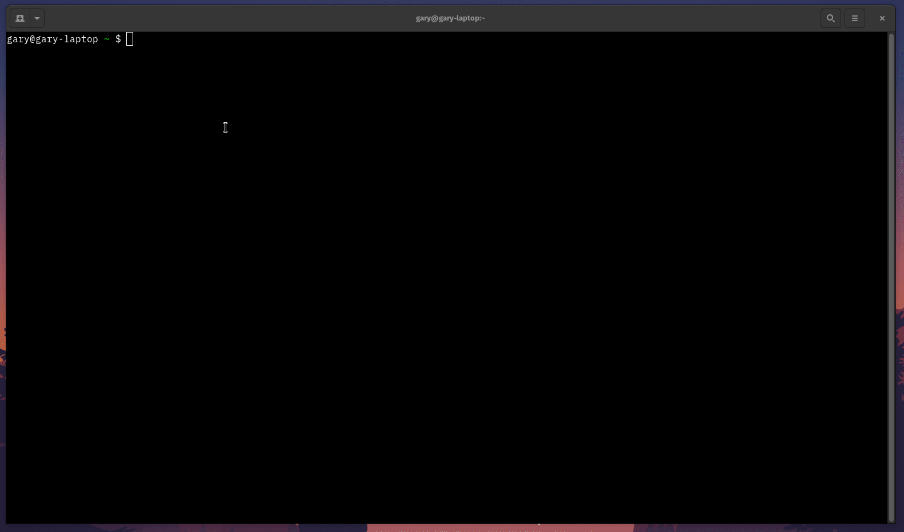

# Shifter - Openshift to Kubernetes Migration Accelerator 

[](https://github.com/google/shifter/actions/workflows/auto-tag-release.yml)

Shifter is a tool which accelerates the migration from OpenShift 3.x / 4.x by translating the applications for Kubernetes, GKE & Anthos and supports migrating to Service Mesh with ASM + Istio Support.
            
<p float="left">
	
</p>
 

## Capabilities

*  Convert existing manifest files from OpenShift to Kubernetes.
*  Convert or extract manifest files from a running OpenShift cluster.
*  Run locally via a CLI tool or deploy a web-based user interface.
*  Convert OpenShift routes/networking to Google ILB/ELB or Istio/ASM virtual services + gateway creation.
*  Convert OpenShift templates to helm charts.
*  Convert ImageStreams to Images + Modify on the fly the Container Registry source.
*  Use GCS Buckets as the source/destination.


## Issues and Feature Requests

If you have issues or would like to see some functionality added please raise a issue via Github Issues: [https://github.com/google/shifter/issues](https://github.com/google/shifter/issues)

For issues please indicate:

1. Your operating system and version.
2. Your OpenShift cluster version.
3. Attach a copy of the manifest (if possible).
4. Attach a copy of the log output (if possible).
5. Detail the issue or feature in as much detail as possible.


## Contributing & Development

If you have improvements or fixes, we would love to have your contributions.
Please read [CONTRIBUTING.md](CONTRIBUTING.md) for more information on the process we would like
contributors to follow.

For development see [DEVELOPMENT.md](DEVELOPMENT.md) for details on pre-requisites and style guides.


## Components

Shifter can either be ran via the command line or via a web ui front end.

### Shifter

Provides the backend service required by the front-end application and also provides the CLI tooling if the front-end web interface is not required.

##### Releases

*  Binaries - [https://github.com/google/shifter/releases](https://github.com/google/shifter/releases)
*  Docker Image - []()

##### Documentation 

Read the detailed documentation at [shifter/README.md](shifter/README.md)

##### Demo

<p float="left">
	
</p>

### Shifter-UI

Provides a front-end application written in Vue that connects to the Shfiter API's, for more information see 
##### Run The Latest Version Locally 

1) Get the Source & Run Latest the latest Docker Release
```

git clone https://github.com/google/shifter 
cd shifter
docker-compose -f docker-compose.yml up

```

## Google Cloud Deployment

Deployment to other cloud providers should be possible but has not been tested.

## Stargazers over time

[](https://starchart.cc/google/shifter)
